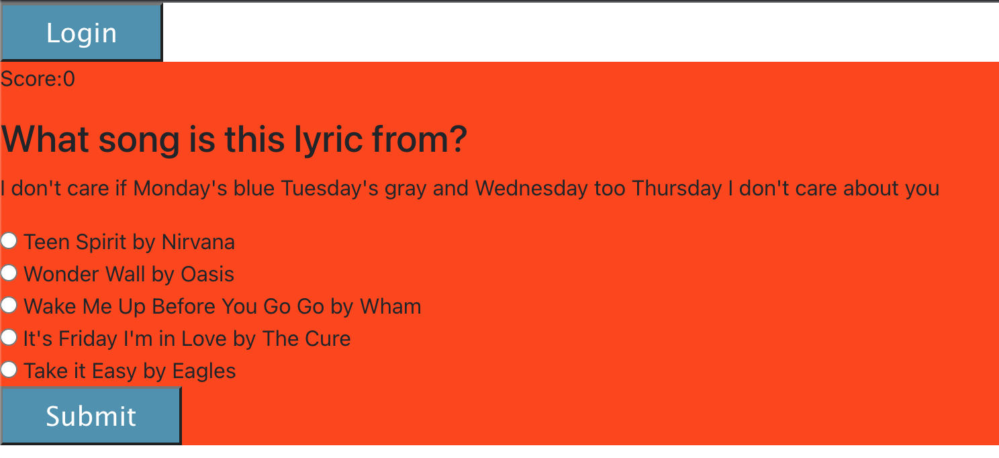

# Well-Versed
  ##  
  ##  
  ##  
  ##  

  ## Licensing:
  
  ## Table of Contents: 
  - [Description](#description)
  - [Technology](#technology)
  - [Installation](#installation)
  - [Usage](#usage)
  - [Questions](#questions)

  ## Description:
  This is a single page game app that quizzes users about popular songs from a curated database of lyrics.  Users can create an account to allow access to a game customaied to give one extra point to users who correclty match title and artist of songs released 25 years after or 5 years prior to their birth.   
  ## Technology:
  React, MongoDB, Mongoose, Node.js, Express.js
  ## Installation: 
  This application is deployed Heroku. You can find it here:[deployed game](https://well-versed-game.herokuapp.com/)
  If you would like to work with the code on you local host, clone the repository by typing the following in your terminal: 	`git clone git@github.com:tripledawg/well-versed.git`.  Open a terminal at the root level. Run `npm run seed` to seed the data.  Run 'npm start' to start the server.   Navigate to the game-client directory in your terminal. Run `npm install` to install necessary node.js dependencies.  Run 'npm start' to start the React application. 
  ## Usage: 
  When users click 'Start a game' they are taken to a page with a randomly generated song lyric displayed and 5 randomly generated multiple choice title and artist answers. Users select the answer and click submit until the 5th question is reached.  Then the user's score is displayed.  They are then prompted to play again as a guest or sign up for custom games by creating a user account. If the user creates a custom account, they are then presented with a game that gives them bonus points for corract answers about songs released five or more years prior to their birth or 30 years after their birth year.    
  ## License: 
  https://opensource.org/licenses/MIT 
  ## Questions: 
  lmc@uga.edu
  
  <https://github.com/tripledawg>